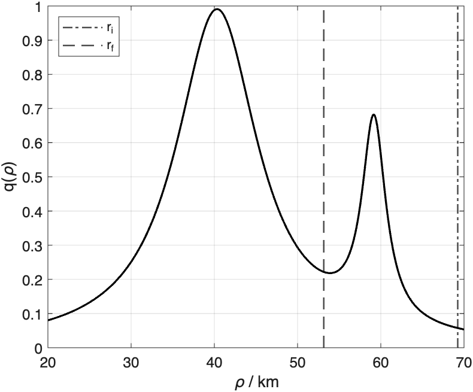
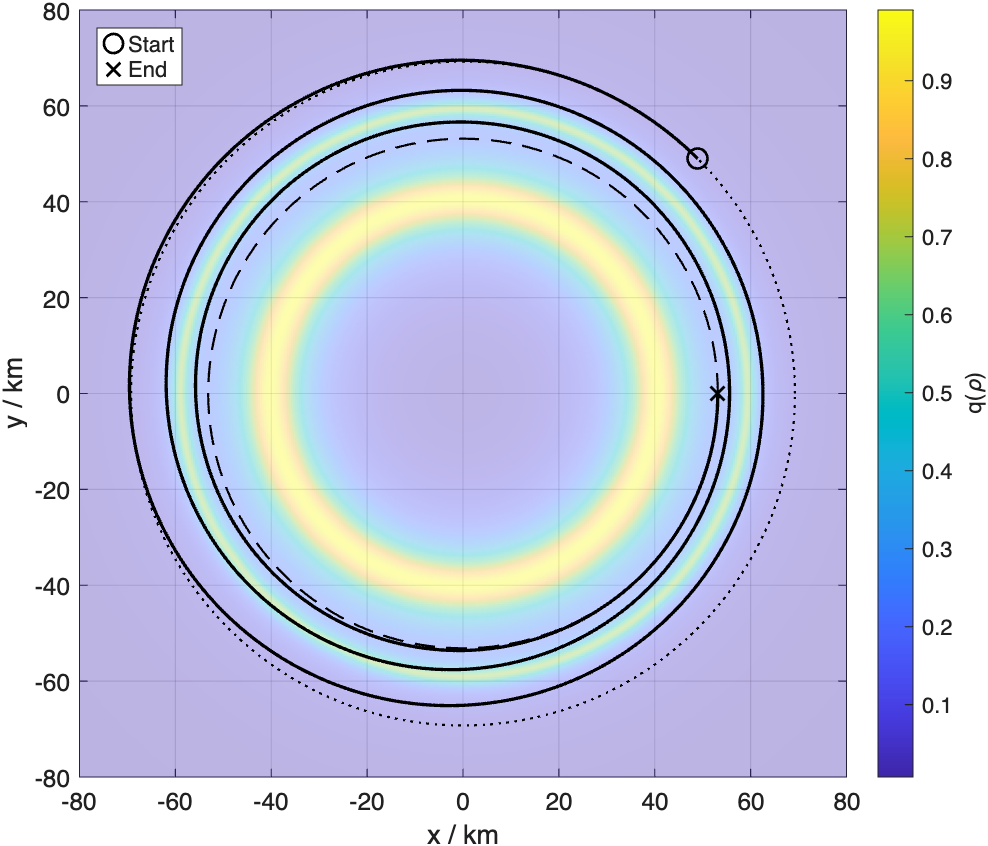
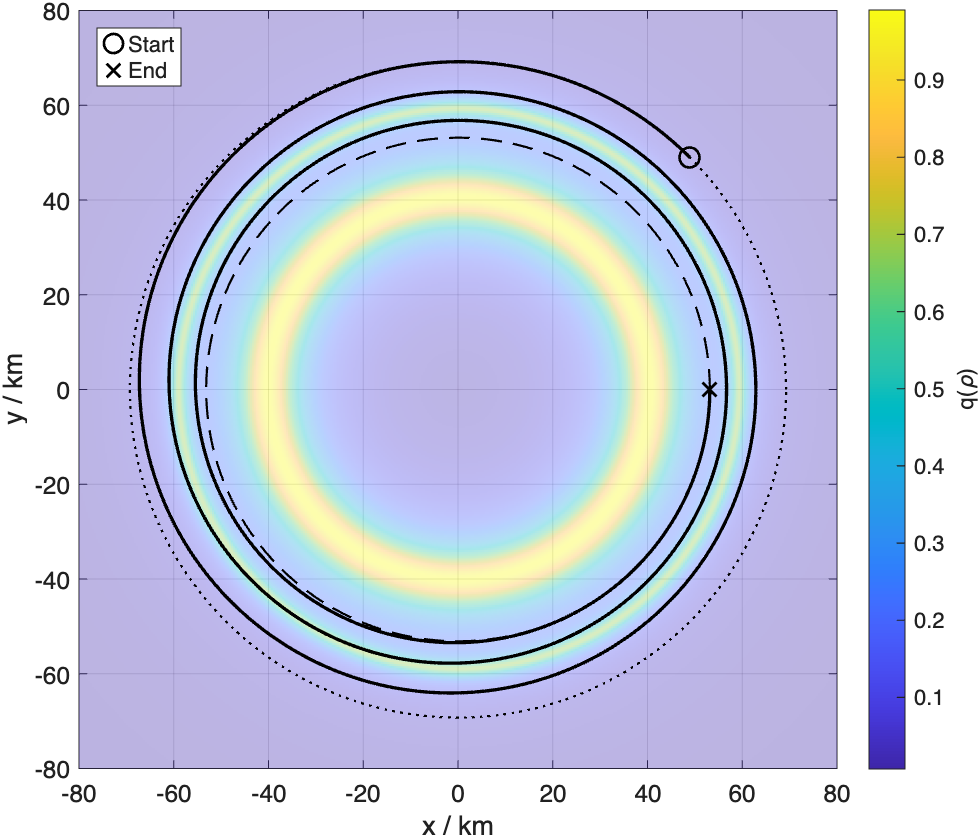
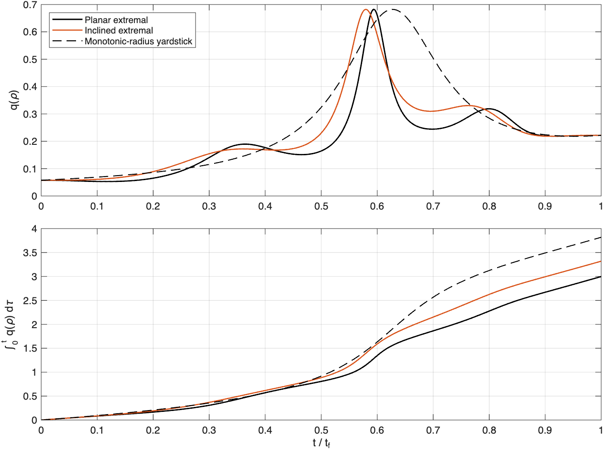
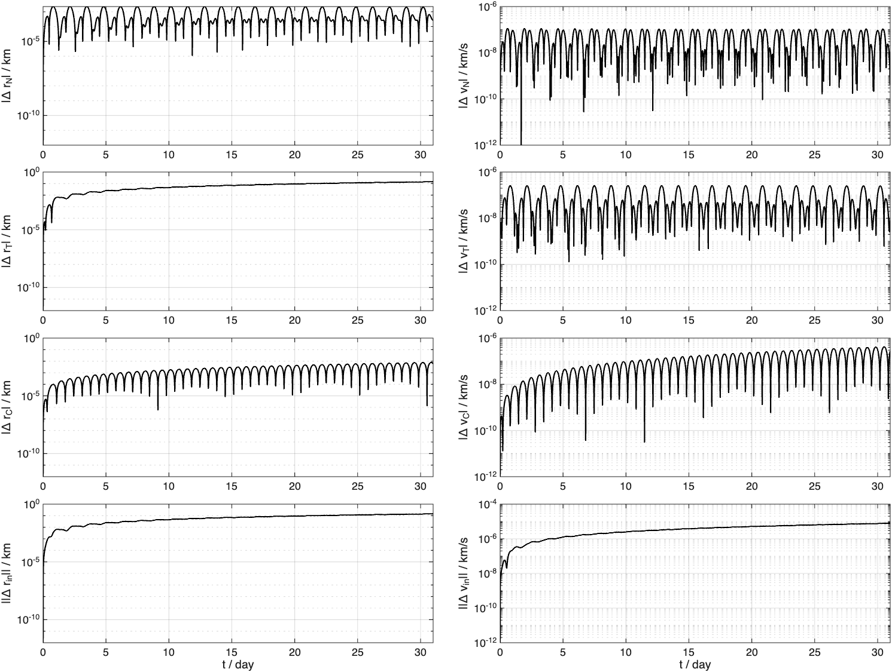
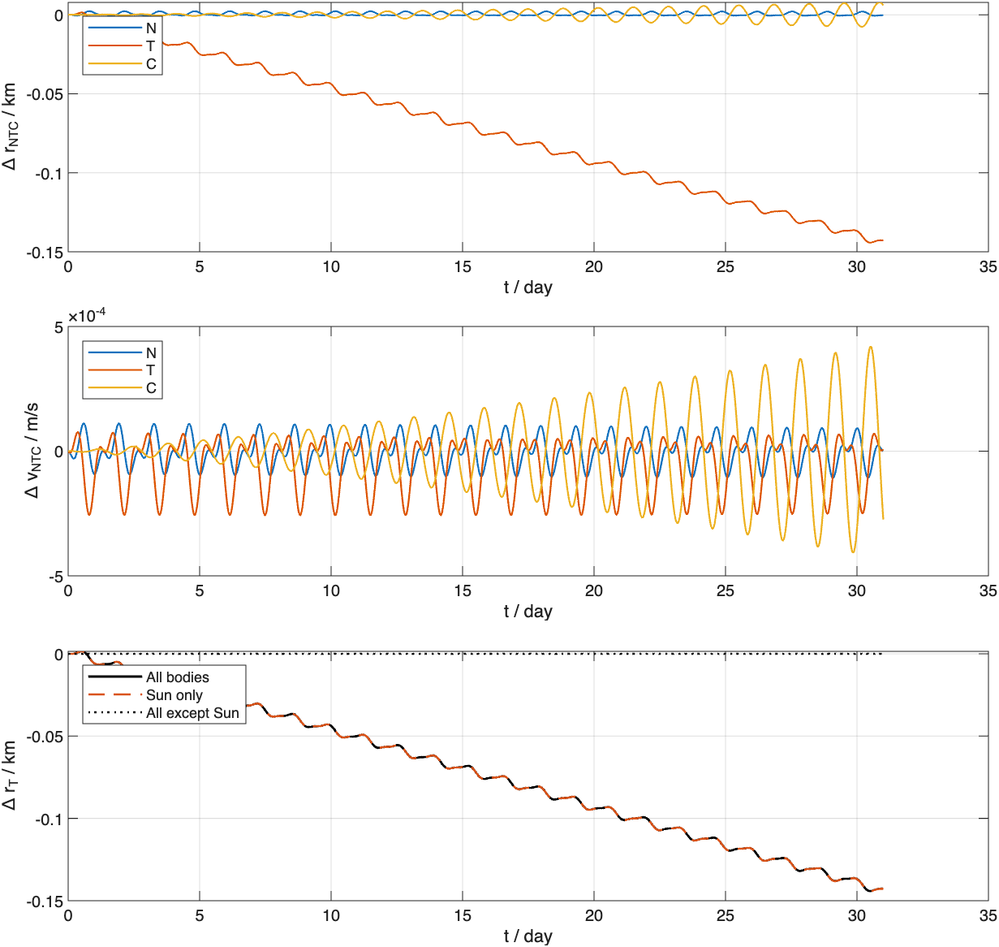

<!--
README.md — Documents the Eros fixed-throttle PMP transfer study.
It distinguishes verified numerical results from assumptions and model limits.
Author: Pasquale Marzaioli
-->

# Continuous Low-Thrust Guidance about 433 Eros

**Author:** Pasquale Marzaioli

This MATLAB repository studies a fixed-throttle, direction-controlled transfer about
433 Eros. A Pontryagin Minimum Principle (PMP) boundary-value problem minimizes a
synthetic radial residence-time cost, first in-plane and then with a $3.5^\circ$
terminal plane change. A separate SPICE propagation measures sensitivity to
third-body gravity over 31 days.

The computed trajectories are **PMP stationary extremals** found by finite
multistart single shooting. They are not proven global minima. The SPICE result is a
**third-body sensitivity study**, not a validation of the point-mass Eros model.

The main entry point is [`eros_continuous_guidance.m`](eros_continuous_guidance.m).
Verified numerical output is recorded in [`results.md`](results.md), and the
derivative regression is in [`tests/verify_derivatives.m`](tests/verify_derivatives.m).

## Verified reference result

| Quantity | Planar extremal | $3.5^\circ$ extremal |
|---|---:|---:|
| Transfer time | 6762.732099 min | 6702.237238 min |
| Final mass | 24.997024434 kg | 24.997051051 kg |
| Propellant | 2.975566 g | 2.948949 g |
| Dimensionless cost $J$ | 2.997538571 | 3.318155763 |
| Terminal position error | $7.264\times10^{-8}$ km | $1.106\times10^{-8}$ km |
| Terminal velocity error | $3.708\times10^{-9}$ m/s | $5.965\times10^{-10}$ m/s |

The inclined branch raises the synthetic cost by $10.696\%$. This comparison is
between two converged local extremals; it is not a global Pareto bound.

## Physical and modeling assumptions

| Item | Value or interpretation |
|---|---|
| Eros GM | $4.463\times10^{-4}\ \mathrm{km^3/s^2}$, matching `gm_de440.tpc` |
| Reference radius | 17.00 km spherical coordinate convention |
| Initial/final reference radii | 69.25 km / 53.15 km |
| Initial mass | 25.0 kg |
| Fixed thrust | 27.530334 $\mu\mathrm{N}$ |
| Specific impulse | 382.82 s |
| Initial phase | $45^\circ$ |
| Terminal inclination | $0^\circ$ or $3.5^\circ$ |

The Eros GM agrees with the measured value reported by Scheeres, Miller, and
Yeomans and with the bundled DE440 constants kernel. The selected 17 km reference
sphere defines the repository's radial coordinate; because Eros is irregular, the
quoted $h_i=52.25$ km and $h_f=36.15$ km are offsets from that convention, not
local surface clearance everywhere.

The original study paired $3.5\times10^{-4}\ \mathrm{km^3/s^2}$ with
21.59 $\mu\mathrm{N}$. After correcting GM, thrust is scaled to 27.530334
$\mu\mathrm{N}$ to preserve the original dimensionless thrust-to-gravity ratio.
This is a design assumption, not a flight-qualified propulsion specification.

## Mathematical formulation

### Dynamics and objective

With nondimensional state
$\mathbf{x}=[\mathbf{r},\mathbf{v},m]$, the fixed-throttle dynamics are

$$
\dot{\mathbf r}=\mathbf v,\qquad
\dot{\mathbf v}=-\frac{\mathbf r}{r^3}+
\frac{T}{m}\boldsymbol{\alpha},\qquad
\dot m=-\frac{T}{I_{sp}g_0},\qquad
\|\boldsymbol{\alpha}\|=1.
$$

The objective is

$$
J=\int_0^{t_f}q(r(t))\,dt,
$$

where

$$
q(\rho)=
\frac{k_1}{k_2+(\rho-\rho_A)^2}+
\frac{k_3}{k_4+(\rho-\rho_B)^2}.
$$

Here $\rho$, $\rho_A$, and $\rho_B$ are nondimensional. Their physical peak
radii are 40.314 km and 59.170 km. The coefficients define a **dimensionless
synthetic cost field**. No measurement, particle size distribution, impact model,
or physical density unit is assigned, so $J$ must not be interpreted as particle
fluence or hazard probability.

### PMP conditions

The minimized Hamiltonian is

$$
H=q(r)+\boldsymbol{\lambda}_r\cdot\mathbf v
-\boldsymbol{\lambda}_v\cdot\frac{\mathbf r}{r^3}
-\frac{T}{m}\|\boldsymbol{\lambda}_v\|
+\lambda_m\dot m,
$$

and the stationary thrust direction is

$$
\boldsymbol{\alpha}^*=
-\frac{\boldsymbol{\lambda}_v}{\|\boldsymbol{\lambda}_v\|}.
$$

Thrust magnitude is fixed by the problem definition. Therefore this is
direction-only full-throttle control, not a derived bang-bang throttle law.

The shooting variables are the seven initial costates and free final time. The
eight terminal equations are

$$
\mathbf r(t_f)=\mathbf r_f,\quad
\mathbf v(t_f)=\mathbf v_f,\quad
\lambda_m(t_f)=0,\quad
H(t_f)=0.
$$

The final Cartesian position and velocity are fixed. They describe a selected
phase point with circular speed, not a terminal circular-orbit manifold.

### Nondimensionalization

$$
DU=69.25\ \mathrm{km},\qquad
MU=25\ \mathrm{kg},\qquad
TU=\sqrt{\frac{DU^3}{\mu}}=27278.232281\ \mathrm{s}.
$$

This gives $VU=0.0025386542\ \mathrm{km/s}$, nondimensional gravity
$\mu=1$, and nondimensional thrust $T=0.0118327079$.

## Numerical method

1. Two deterministic batches of 300 random planar guesses are screened.
2. The 12 best guesses per batch are refined with `fsolve` and the analytical
   shooting Jacobian.
3. Every configured batch is evaluated; the lowest-cost converged anchor is kept.
4. A 32-step physical-GM/thrust continuation moves from the legacy scaling to the
   corrected Eros model.
5. Four warm-started steps rotate the terminal velocity to $3.5^\circ$.

Dogleg is the primary nonlinear method; Levenberg-Marquardt is used only as a
continuation fallback. This improves branch tracking but does not establish
uniqueness or global optimality.

The implementation checks:

- all eight shooting conditions with residual norm below $10^{-8}$;
- physical terminal position and velocity errors below $10^{-5}$;
- $\max |H|<10^{-8}$ for both final extremals;
- analytical canonical and Hamiltonian derivatives against central differences;
- exact zero NTC differences for identical histories;
- Eros GM agreement between guidance parameters and the loaded SPICE kernel.

The dashed monotonic-radius curve in the cumulative-cost figure is only a
same-duration kinematic yardstick. It is not dynamically feasible and is not an
optimal-control competitor.

## Third-body sensitivity study

The final inclined state is interpreted in `ECLIPJ2000` and propagated from
`2012 JAN 15 00:00:00 TDB` for 31 days. Differential gravity from the Sun, Moon,
planets, and Pluto is evaluated from SPICE states:

$$
\ddot{\mathbf r}=-\mu_E\frac{\mathbf r}{r^3}
+\sum_j\mu_j\left[
\frac{\mathbf r_j-\mathbf r}{\|\mathbf r_j-\mathbf r\|^3}
-\frac{\mathbf r_j}{\|\mathbf r_j\|^3}
\right].
$$

| 31-day third-body minus Kepler metric | Value |
|---|---:|
| Position norm | 0.142840974 km (142.841 m) |
| Velocity norm | $7.786089\times10^{-6}$ km/s (7.786 mm/s) |
| Semimajor-axis difference | $-3.057562\times10^{-5}$ km (-0.0306 m) |
| Argument-of-latitude difference | $-0.05923595^\circ$ |
| Maximum eccentricity difference | $4.971265\times10^{-5}$ |

The Sun dominates this particular third-body decomposition. This does **not**
mean solar gravity dominates the complete near-Eros force error.

## Validity boundary

The study verifies its equations, derivatives, endpoint residuals, conserved
Hamiltonian behavior, deterministic reproduction, and the stated third-body
comparison. It does not establish flight validity because it omits:

- Eros spherical-harmonic or polyhedral gravity and body rotation;
- solar radiation pressure, shadowing, attitude, and area-to-mass effects;
- a calibrated dust/ejecta environment;
- navigation uncertainty, state estimation, feedback, and actuator constraints;
- collision/clearance constraints relative to the actual shape;
- second-order sufficient conditions or a global search certificate.

These omissions matter. The published Eros dynamics study identifies gravity-field
and rotation effects as important in the close-field regime, and the NASA PDS
archive provides a 15-by-15 Eros gravity solution. Consequently, the present
point-mass transfer is a reproducible method demonstration and initializer for a
higher-fidelity study, not an operational trajectory.

## Reproduction

### Requirements

- MATLAB R2025b or a compatible release;
- Optimization Toolbox (`fsolve`);
- an official, platform-compatible NAIF MICE Toolkit installed locally at
  `mice/src/mice` and `mice/lib`;
- the retained kernels under `Kernels/`.

MICE is intentionally ignored by Git and is **not vendored**. Download it from
the official [NAIF MATLAB Toolkit page](https://naif.jpl.nasa.gov/naif/toolkit_MATLAB.html).

Run the complete study:

~~~matlab
eros_continuous_guidance
~~~

Figures are written to `plots/`. To keep a verification run outside the worktree:

~~~bash
SGN_OUTPUT_DIR=/tmp/eros-guidance matlab -batch "eros_continuous_guidance"
~~~

Run the lightweight regression:

~~~bash
matlab -batch "run('tests/verify_derivatives.m')"
~~~

The complete run performs randomized screening with a fixed seed and can take
several minutes.

## Repository layout

~~~text
eros_continuous_guidance.m  Main solve, continuation, checks, and export
functions/                  Dynamics, sensitivities, shooting, SPICE, plots
tests/verify_derivatives.m  Finite-difference and NTC regression
Kernels/                    Retained SPICE kernels and original metadata
plots/                      Verified reference-run figures
results.md                  Full numerical record and audit conclusions
~~~

`run_diary.txt` is an ignored local runtime artifact; the publishable numerical
record is `results.md`.

All kernels remain in the repository as requested. The driver currently loads only
`naif0012.tls`, `de440s.bsp`, `2000433.bsp`, and `gm_de440.tpc`.

## Sources and data provenance

- D. J. Scheeres, J. K. Miller, and D. K. Yeomans,
  [*The Orbital Dynamics Environment of 433 Eros: A Case Study for Future Asteroid Missions*](https://tda.jpl.nasa.gov/progress_report/42-152/152F.pdf),
  JPL IPN Progress Report 42-152, 2003.
- NASA Planetary Data System,
  [*NEAR Eros Radio Science Derived Products — Gravity V1.0*](https://pds.nasa.gov/ds-view/pds/viewProfile.jsp?dsid=NEAR-A-RSS-5-EROS%2FGRAVITY-V1.0).
- NASA/JPL NAIF,
  [*Rules Regarding Use of SPICE*](https://naif.jpl.nasa.gov/naif/rules.html).

The bundled kernels retain their original files and metadata. NAIF permits
redistribution of unmodified NAIF kernels under its published rules; kernels from
other producers remain subject to their source terms.

## Citation

~~~bibtex
@software{marzaioli_eros_continuous_guidance,
  author = {Pasquale Marzaioli},
  title = {Continuous Low-Thrust Guidance about 433 Eros},
  year = {2026},
  url = {https://github.com/PasqualeMarzaioli/eros-continuous-guidance}
}
~~~

## License status

No project license is included. No permission to copy, modify, or redistribute the
project source is granted. Third-party kernels and MICE remain governed by their
respective source terms.
