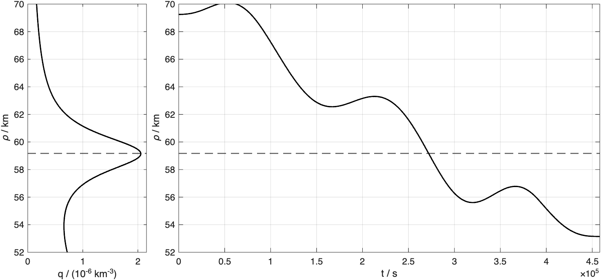
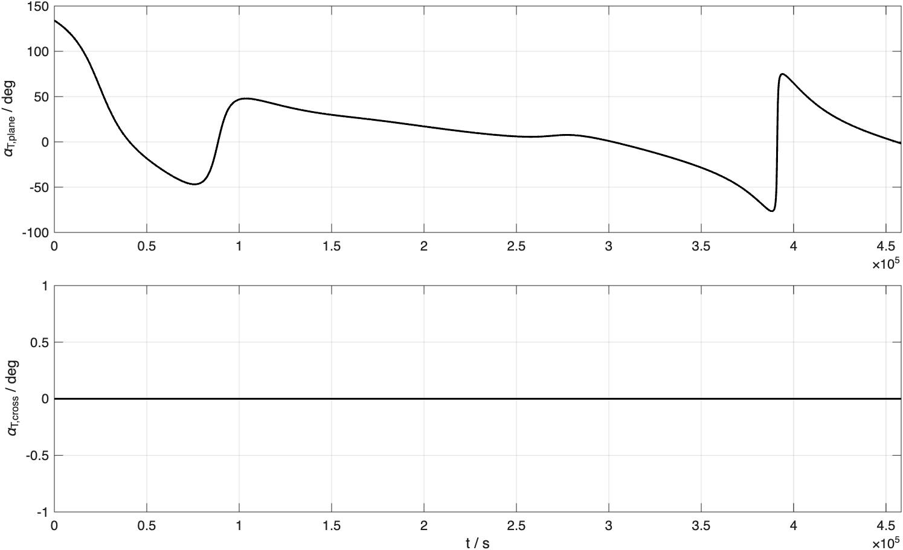
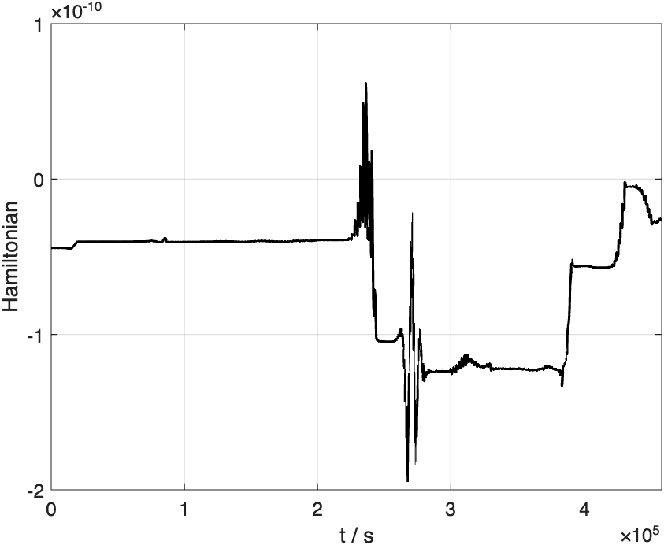
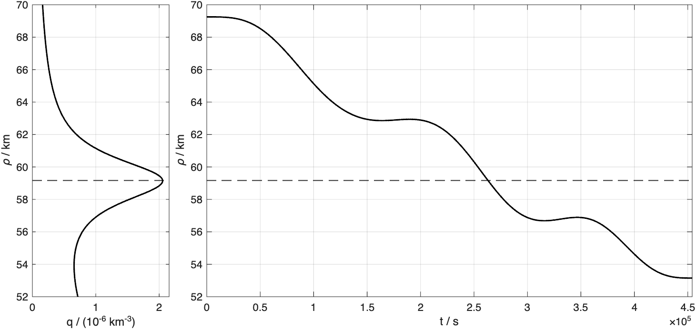
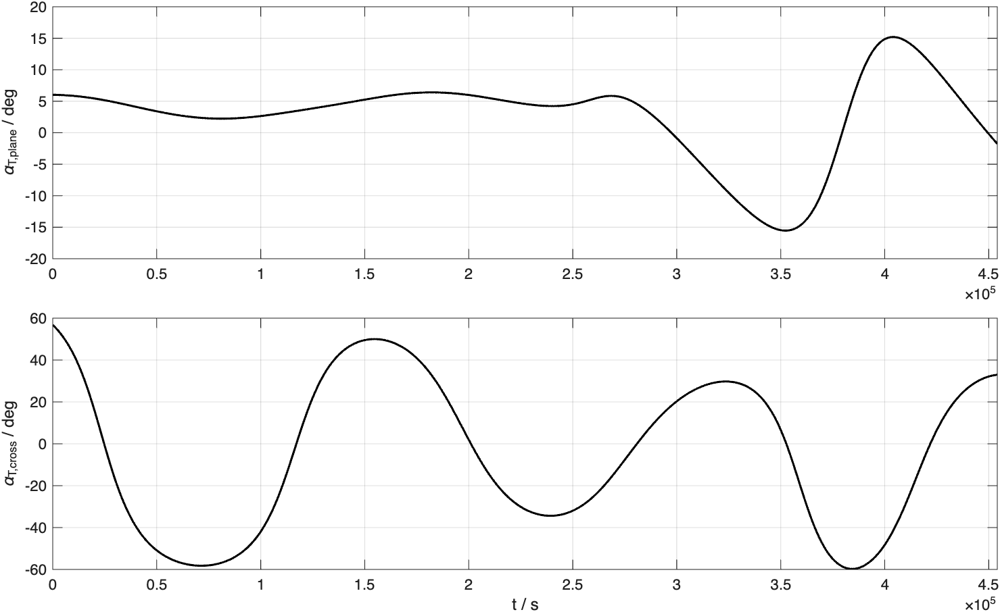
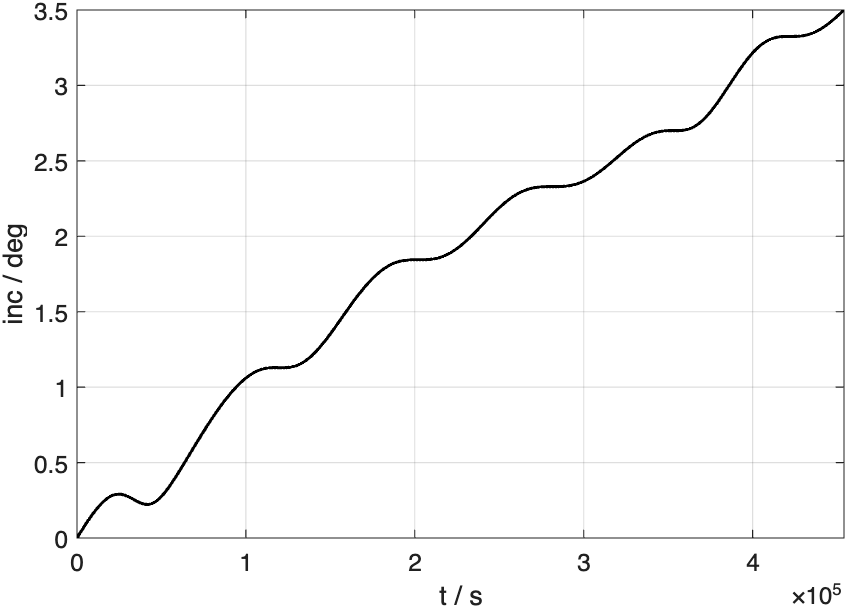
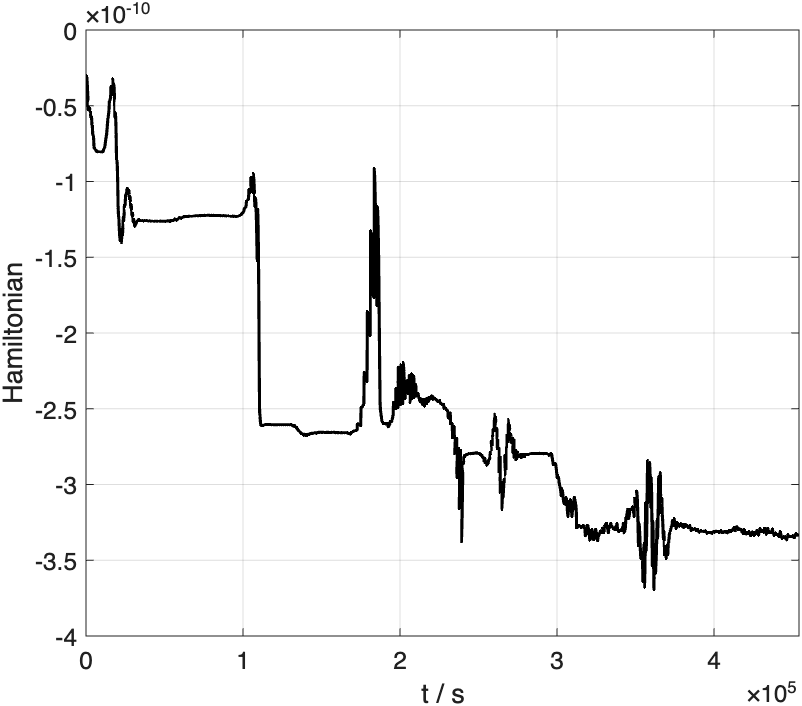
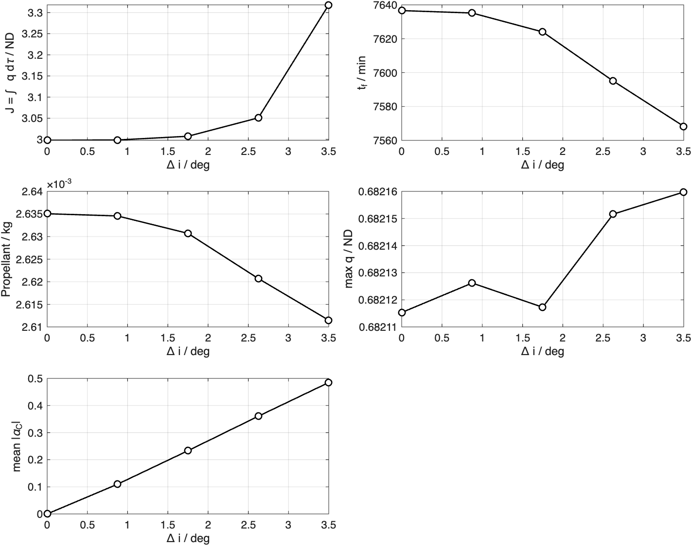
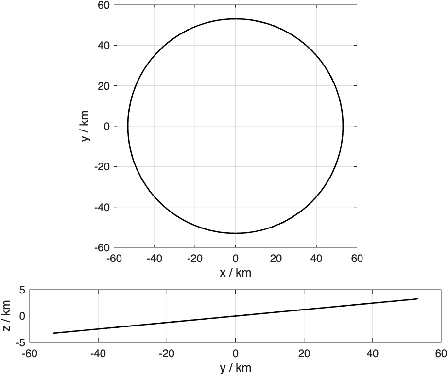
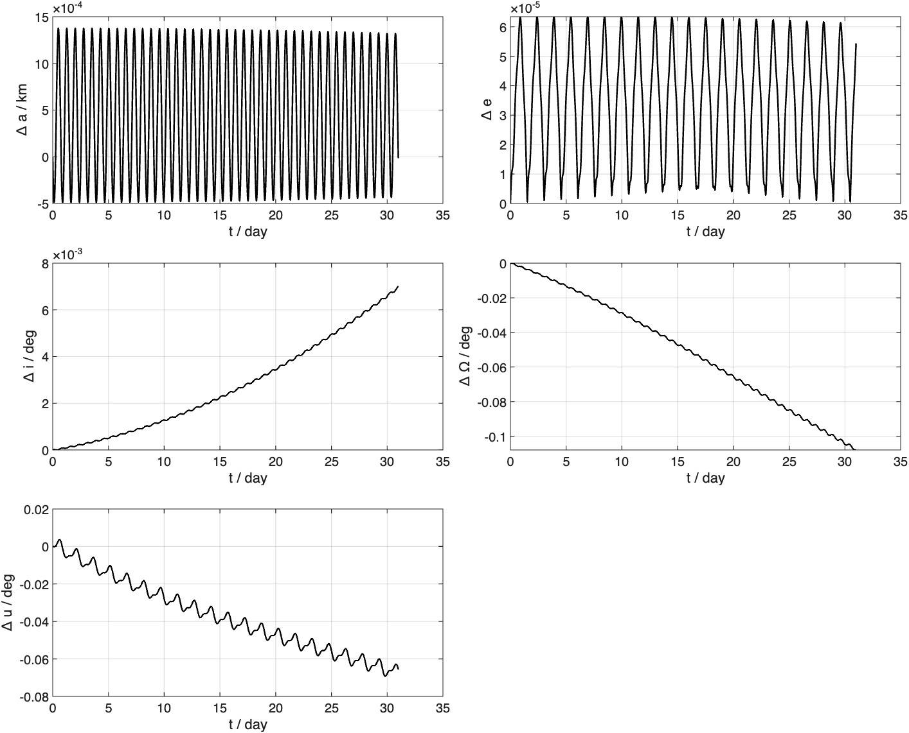

# Continuous Low-Thrust Guidance about 433 Eros under Dust-Density Cost

**Author:** Pasquale Marzaioli

This repository implements a complete optimal-control study of a continuous low-thrust transfer about asteroid **433 Eros**. The spacecraft lowers its circular altitude while optionally changing orbital inclination, under a cost that penalizes integrated exposure to a radially structured dust environment. The transfer is solved with the **Pontryagin Minimum Principle (PMP)** by single shooting, continued in inclination, and validated by a **SPICE / MICE** free-flight comparison against an Eros-centered n-body model.

The driver script is [`eros_continuous_guidance.m`](eros_continuous_guidance.m). All solvers, dynamics, dust models, SPICE helpers, and plotting routines live as separate MATLAB files in [`functions/`](functions/). Numerical tables from the reference run are in [`results.md`](results.md); figures are in [`plots/`](plots/).

---

## Abstract

A bang (full-thrust) extremal is computed for a circular-to-circular transfer from altitude \(h_i = 52.25\,\mathrm{km}\) to \(h_f = 36.15\,\mathrm{km}\) about Eros (\(\mu = 3.5\times 10^{-4}\,\mathrm{km}^3/\mathrm{s}^2\), \(R_a = 17\,\mathrm{km}\)). The objective is the time integral of a bimodal radial dust density. Random costate screening followed by trust-region single shooting with an analytic shooting Jacobian yields a planar solution with terminal position error \(\sim 10^{-7}\,\mathrm{km}\) and velocity error \(\sim 10^{-9}\,\mathrm{m/s}\). Homotopy continuation extends the extremal to a \(3.5^\circ\) plane change. A 31-day n-body free flight from the inclined terminal state, forced by differential third-body accelerations from JPL SPICE ephemerides, remains within \(\sim 0.16\,\mathrm{km}\) of the Kepler reference and confirms that the local two-body PMP model is an appropriate guidance approximation over that horizon.

---

## 1. Motivation and problem statement

Near-asteroid operations can be constrained by dust or ejecta environments whose density varies strongly with radial distance. A guidance law that merely minimizes time or propellant may drive the vehicle through a dense shell; conversely, a dust-aware cost can reshape the radius history and the thrust steering so that the spacecraft spends less time where the density is highest.

The mission considered here is deliberately local to Eros:

- **Initial orbit.** Circular, altitude \(h_i = 52.25\,\mathrm{km}\), phase \(45^\circ\).
- **Final orbit.** Circular, altitude \(h_f = 36.15\,\mathrm{km}\), with optional inclination relative to the initial plane.
- **Propulsion.** Continuous thrust of fixed magnitude \(T = 21.59\times 10^{-9}\,\mathrm{kg\,km/s}^2\) and fixed specific impulse \(I_{sp} = 382.82\,\mathrm{s}\), with initial mass \(m_0 = 25\,\mathrm{kg}\).
- **Objective.** Minimize integrated dust exposure subject to the dynamics and free final time.

The mathematical program is therefore a free-time, free-final-mass optimal control problem with a state-dependent running cost and a bang control structure under the PMP.

---

## 2. Physical model

### 2.1 Point-mass gravity and thrust

In an Eros-centered inertial frame the translational dynamics are

$$
\dot{\mathbf{r}} = \mathbf{v}, \qquad
\dot{\mathbf{v}} = -\mu\,\frac{\mathbf{r}}{r^3} + \frac{T}{m}\,\boldsymbol{\alpha}, \qquad
\dot{m} = -\frac{T}{I_{sp}\,g_0},
$$

where \(r=\|\mathbf{r}\|\), \(\boldsymbol{\alpha}\) is a unit thrust direction, \(\mu = 3.5\times 10^{-4}\,\mathrm{km}^3/\mathrm{s}^2\), and \(g_0 = 9.80665\times 10^{-3}\,\mathrm{km/s}^2\). The thrust magnitude is held at its maximum for the entire transfer (no coast arcs appear in the converged solutions reported here).

### 2.2 Dust density field

Dust is modelled as a radially symmetric density with two Lorentzian-like peaks centred at \(\rho_A = R_a + 23.314\,\mathrm{km}\) and \(\rho_B = R_a + 42.170\,\mathrm{km}\):

$$
q(\rho)
=
\frac{k_1}{k_2 + (\rho - \rho_A)^2}
+
\frac{k_3}{k_4 + (\rho - \rho_B)^2}.
$$

The coefficients \((k_1,k_2,k_3,k_4)\) are given in the script and in [`results.md`](results.md). The outer peak \(\rho_B\) lies above the initial circular radius and is therefore a critical feature of the cost landscape: any excursion that climbs toward \(\rho_B\) is heavily penalized.


**Figure 1.** Physical dust density \(q(\rho)\) versus radial distance. Vertical markers indicate the initial and final circular radii \(h_i+R_a\) and \(h_f+R_a\). The transfer must descend through the field while avoiding unnecessary dwell near the outer peak.

### 2.3 Nondimensionalization

All optimal-control integrations are performed in nondimensional units

$$
\mathrm{DU} = h_i + R_a, \qquad
\mathrm{MU} = m_0, \qquad
\mathrm{TU} = \sqrt{\frac{\mathrm{DU}^3}{\mu}}, \qquad
\mathrm{VU} = \frac{\mathrm{DU}}{\mathrm{TU}},
$$

so that \(\mu_{\mathrm{ND}} = 1\) and \(m_0 = 1\). Thrust, specific impulse, and \(g_0\) are scaled consistently. In the reference run,

$$
\mathrm{DU} = 69.25\,\mathrm{km},\quad
\mathrm{TU} \approx 3.0803\times 10^{4}\,\mathrm{s},\quad
\mathrm{VU} \approx 2.248\times 10^{-3}\,\mathrm{km/s}.
$$

---

## 3. Optimal control formulation (PMP)

### 3.1 Cost and decision variables

With nondimensional state \(\mathbf{x}=[\mathbf{r}^\top,\mathbf{v}^\top,m]^\top\), the Bolza problem reduces to a Mayer-free Lagrange cost

$$
J[\boldsymbol{\alpha},t_f]
=
\int_0^{t_f} q\bigl(r(t)\bigr)\,dt,
$$

with free final time \(t_f>0\) and free final mass \(m(t_f)\). The terminal manifold enforces circular-orbit boundary conditions on position and velocity (planar or inclined).

### 3.2 Hamiltonian and primer control

Introduce costates \(\boldsymbol{\lambda}_r\in\mathbb{R}^3\), \(\boldsymbol{\lambda}_v\in\mathbb{R}^3\), and \(\lambda_m\in\mathbb{R}\). The autonomous Hamiltonian is

$$
H
=
q(r)
+ \boldsymbol{\lambda}_r\cdot\mathbf{v}
+ \boldsymbol{\lambda}_v\cdot\Bigl(-\frac{\mathbf{r}}{r^3} + \frac{T}{m}\boldsymbol{\alpha}\Bigr)
+ \lambda_m\,\dot{m}.
$$

Pontryagin minimization over \(\|\boldsymbol{\alpha}\|=1\) yields the **primer** direction

$$
\boldsymbol{\alpha}^\star
=
-\frac{\boldsymbol{\lambda}_v}{\|\boldsymbol{\lambda}_v\|},
$$

provided \(\|\boldsymbol{\lambda}_v\|\neq 0\). Substituting the optimal control gives

$$
H^\star
=
q(r)
+ \boldsymbol{\lambda}_r\cdot\mathbf{v}
- \boldsymbol{\lambda}_v\cdot\frac{\mathbf{r}}{r^3}
- \frac{T}{m}\|\boldsymbol{\lambda}_v\|
+ \lambda_m\,\dot{m}.
$$

### 3.3 Canonical equations

The state–costate system implemented in [`functions/canonicalDynamics.m`](functions/canonicalDynamics.m) is

$$
\begin{aligned}
\dot{\mathbf{r}} &= \mathbf{v},\\
\dot{\mathbf{v}} &= -\frac{\mathbf{r}}{r^3} + \frac{T}{m}\boldsymbol{\alpha}^\star,\\
\dot{m} &= -\frac{T}{I_{sp}\,g_0},\\
\dot{\boldsymbol{\lambda}}_r &= G(\mathbf{r})\,\boldsymbol{\lambda}_v - \nabla_{\mathbf{r}} q,\\
\dot{\boldsymbol{\lambda}}_v &= -\boldsymbol{\lambda}_r,\\
\dot{\lambda}_m &= -\frac{T}{m^2}\|\boldsymbol{\lambda}_v\|,
\end{aligned}
$$

where

$$
G(\mathbf{r})
=
\frac{I_3}{r^3} - 3\frac{\mathbf{r}\mathbf{r}^\top}{r^5}
$$

is the gravity gradient (Hessian of \(-\mu/r\) at \(\mu=1\)). Analytic first derivatives of \(q\) and of the primer map are assembled in [`functions/canonicalJacobian.m`](functions/canonicalJacobian.m) and used for shooting sensitivities.

### 3.4 Transversality and shooting residual

With free final mass and free final time, the terminal conditions are the eight scalar equations

$$
\mathbf{r}(t_f)-\mathbf{r}_f=\mathbf{0},\qquad
\mathbf{v}(t_f)-\mathbf{v}_f=\mathbf{0},\qquad
\lambda_m(t_f)=0,\qquad
H^\star(t_f)=0.
$$

The decision vector is therefore

$$
\mathbf{z}
=
\bigl[\boldsymbol{\lambda}_r(0)^\top,\;
\boldsymbol{\lambda}_v(0)^\top,\;
\lambda_m(0),\;
t_f\bigr]^\top
\in\mathbb{R}^8.
$$

Single shooting evaluates the residual by integrating the 14-dimensional canonical system from the known initial state \(\mathbf{x}(0)\) and the guessed costates. When a Jacobian is requested, the code integrates the variational equations

$$
\dot{\Phi} = \frac{\partial\mathbf{f}}{\partial\mathbf{y}}\,\Phi,\qquad
\Phi(0)=[0_{7\times 7};\,I_7]
$$

for the sensitivity of the canonical state \(\mathbf{y}=[\mathbf{x};\boldsymbol{\lambda}]\) to the seven initial costates, then appends the final canonical derivative to obtain \(\partial\mathbf{R}/\partial t_f\).

---

## 4. Numerical method

### 4.1 Random costate screening

Because the shooting map is highly nonlinear, the solver first screens \(N=300\) uniform random costate / time guesses per batch (fixed RNG seed `10775298` for reproducibility). Planar symmetry forces the two out-of-plane costates to zero during the planar search. Cheap integrations at relaxed tolerances rank the candidates; the twelve best are refined with `fsolve` (`trust-region-dogleg`) using the analytic shooting Jacobian. Among all refinements that meet \(\|\mathbf{R}\|<10^{-8}\), the extremal of **lowest dust exposure** is retained.

In the reference run, batch 1 best residual was \(2.23\); batch 2 produced a converged planar extremal.

### 4.2 Inclination continuation

Starting from the planar solution, the target velocity is rotated out of plane,

$$
\mathbf{v}_f(i)
=
v_c\,[\,0,\;\cos i,\;\sin i\,]^\top
\quad\text{(in the nondimensional frame of the script)},
$$

on the grid \(i\in\{0^\circ,0.875^\circ,1.750^\circ,2.625^\circ,3.500^\circ\}\). Each step warm-starts `fsolve` from the previous extremal. All five nodes converge in the reference run.

### 4.3 Verification checks

Independently of the shooting residual, the script asserts:

- terminal position / velocity errors below \(10^{-5}\) (km and m/s, respectively);
- Hamiltonian histories consistent with free-time transversality (near-zero, nearly constant);
- positive final masses along the continuation path;
- n-body osculating-element drifts within prescribed bounds (Section 6).

---

## 5. Results

Detailed tables, costates, and assertion outcomes are in [`results.md`](results.md). The subsections below interpret the exported figures.

### 5.1 Planar optimal transfer

| Quantity | Value |
|---|---|
| \(t_f\) | \(7636.62\,\mathrm{min}\) |
| \(m_f\) | \(24.99736\,\mathrm{kg}\) |
| Propellant | \(\approx 2.64\,\mathrm{g}\) |
| Exposure \(J\) (ND) | \(2.99756\) |
| Position error | \(1.47\times 10^{-7}\,\mathrm{km}\) |
| Velocity error | \(6.73\times 10^{-9}\,\mathrm{m/s}\) |


**Figure 2.** Planar extremal overlaid on the dust-density field in the \(xy\)-plane. The path descends from the outer dashed circle toward the inner orbit while staying clear of the densest outer shell.



**Figure 3.** Left: outer dust peak in micro-density units. Right: radial history of the planar transfer. The trajectory remains below the outer peak \(\rho_B\) after the early phase of the burn.



**Figure 4.** Thrust direction resolved in the instantaneous radial–transverse–cross frame. The in-plane angle \(\alpha_{T,\mathrm{plane}}\) carries the Hohmann-like / primer steering; the cross-track component vanishes by planar symmetry.



**Figure 5.** Autonomous Hamiltonian along the planar extremal. Free-time transversality requires \(H\equiv 0\) (up to integrator noise), providing an independent optimality check.

### 5.2 Inclined transfer (\(3.5^\circ\))

| Quantity | Value |
|---|---|
| \(t_f\) | \(7568.31\,\mathrm{min}\) |
| \(m_f\) | \(24.99739\,\mathrm{kg}\) |
| Propellant | \(\approx 2.61\,\mathrm{g}\) |
| Exposure \(J\) (ND) | \(3.31823\) (\(+10.7\%\) vs planar) |
| Position error | \(1.62\times 10^{-8}\,\mathrm{km}\) |
| Velocity error | \(7.62\times 10^{-10}\,\mathrm{m/s}\) |


**Figure 6.** Inclined extremal on the same dust map. The projected \(xy\) path remains similar; the plane change is accomplished by a sustained out-of-plane primer component.



**Figure 7.** Radial history of the inclined transfer relative to the outer dust peak.



**Figure 8.** In-plane and cross-track thrust angles for the inclined case. The nonzero \(\alpha_{T,\mathrm{cross}}\) history is the control signature of the plane change.



**Figure 9.** Osculating inclination versus time, rising smoothly toward the \(3.5^\circ\) terminal condition.



**Figure 10.** Hamiltonian constancy check for the inclined extremal.

### 5.3 Exposure comparison and inclination trade space


**Figure 11.** Instantaneous density \(q(\rho(t))\) and cumulative exposure \(\int_0^t q\,d\tau\) for the planar and inclined optima, compared with a purely kinematic monotonic-radius yardstick of equal duration. The yardstick is **not** dynamically feasible; it only illustrates that the PMP solutions actively reshape the radius history to reduce exposure relative to a naive descent.



**Figure 12.** Continuation metrics versus plane-change angle \(\Delta i\): total exposure \(J\), transfer time, propellant, peak density encountered, and mean absolute cross-track thrust. Exposure and cross-track effort increase with \(\Delta i\), while propellant remains at the gram scale for this thrust / mass combination.

**Physical reading.** A few degrees of plane change are cheap in propellant under continuous micro-thrust, but they force the primer out of plane and raise integrated dust exposure by about eleven percent at \(3.5^\circ\). Guidance that must meet an inclined science orbit therefore faces a clear exposure–plane-change trade, not a propellant bottleneck.

---

## 6. SPICE n-body free-flight validation

### 6.1 Ephemeris model

After the inclined transfer converges, the terminal physical state is propagated for 31 days from

`2012 JAN 15 00:00:00.000 TDB`

to

`2012 FEB 15 00:00:00.000 TDB`

under

$$
\ddot{\mathbf{r}}
=
-\mu_{\mathrm{Eros}}\frac{\mathbf{r}}{r^3}
+
\sum_{j}
\mu_j
\Biggl(
\frac{\mathbf{r}_j-\mathbf{r}}{\|\mathbf{r}_j-\mathbf{r}\|^3}
-
\frac{\mathbf{r}_j}{\|\mathbf{r}_j\|^3}
\Biggr),
$$

where body states \(\mathbf{r}_j\) are queried from SPICE in the `ECLIPJ2000` frame with `cspice_spkezr`, and gravitational parameters come from `gm_de440.tpc`. Bodies included: Mercury, Venus, Earth, Moon, Mars, Jupiter, Saturn, Uranus, Neptune, Pluto, and the Sun. The reference comparison is the pure Eros two-body (Kepler) orbit from the same initial condition.

Required kernels loaded by the script:

- `Kernels/naif0012.tls`
- `Kernels/de440s.bsp`
- `Kernels/2000433.bsp` (Eros)
- `Kernels/gm_de440.tpc`

### 6.2 Error budgets

| Metric at 31 days (n-body − Kepler) | Value |
|---|---|
| \(\|\Delta\mathbf{r}\|\) | \(1.609\times 10^{-1}\,\mathrm{km}\) |
| \(\|\Delta\mathbf{v}\|\) | \(7.826\times 10^{-6}\,\mathrm{km/s}\) |
| \(\Delta a\) | \(-1.609\times 10^{-5}\,\mathrm{km}\) |
| \(\Delta u\) (argument of latitude) | \(-6.566\times 10^{-2}\,{}^\circ\) |
| \(\max\|\Delta e\|\) | \(6.343\times 10^{-5}\) |



**Figure 13.** Ecliptic-plane and side views of the 31-day free flight: Kepler reference (dashed) versus full n-body (solid). The orbits remain visually coincident at the plotted scale; quantitative separation appears in the NTC budgets.


**Figure 14.** Absolute radial (N), tangential (T), and cross-track (C) position and velocity differences in the rotating orbital frame of the Kepler reference, plus inertial norms. Semilog axes emphasize the slow secular growth of the tangential / phase error.


**Figure 15.** Signed NTC errors for the full force model, together with a Sun-only versus all-except-Sun decomposition and a leave-one-out bar chart of each body's marginal contribution to the final tangential position error. The Sun dominates the differential perturbation at Eros; planetary contributions are secondary but retained for completeness.



**Figure 16.** Differences in osculating \(a\), \(e\), \(i\), \(\Omega\), and argument of latitude \(u\) between n-body and Kepler histories. Energy-related elements (\(a\), \(e\)) stay extremely tight; the accumulated phase offset \(\Delta u\) accounts for most of the inertial position discrepancy.

**Interpretation.** Over one month, third-body forcing perturbs the local circular orbit at the decimetre / micrometre-per-second level relative to Kepler, without destroying the orbital geometry assumed by the PMP design. The two-body bang guidance solution is therefore a consistent first-order plan for subsequent closed-loop or ephemeris-aware refinement.

---

## 7. How to reproduce

### Requirements

- MATLAB R2025b (or compatible) with the **Optimization Toolbox** (`fsolve`).
- Vendored **MICE** mex libraries under `mice/lib/` matching the host architecture:
  - Apple Silicon: `mice.mexmaca64`
  - Intel macOS: `mice.mexmaci64`
- SPICE kernels listed in Section 6.1 under `Kernels/`.

### Run

From the project root:

```matlab
eros_continuous_guidance
```

or, non-interactively:

```bash
matlab -batch "eros_continuous_guidance"
```

The script should place [`functions/`](functions/), `mice/src/mice`, and `mice/lib` on the MATLAB path, then load kernels, solve the planar and inclined problems, run the n-body check, and export all figures to `plots/` (or to the directory named by the environment variable `SGN_OUTPUT_DIR` if set). If you invoke routines interactively, add the library first:

```matlab
addpath(fullfile(pwd, 'functions'));
```

Expect several minutes of runtime: random screening of hundreds of costate guesses dominates the wall clock.

### Expected artifacts

- Console metrics matching [`results.md`](results.md) (to printed precision, seed fixed).
- The sixteen PNG files under [`plots/`](plots/).

---

## 8. Repository layout

```
eros-continuous-guidance/
├── eros_continuous_guidance.m   % main driver (setup, solve, validate, export)
├── functions/                   % MATLAB library (PMP, dust, SPICE, plots)
├── README.md                    % this document
├── results.md                   % numerical tables from the reference run
├── plots/                       % exported figures (160 dpi)
├── Kernels/                     % SPICE kernels (LSK, SPK, PCK)
└── mice/                        % NAIF MICE toolkit (MATLAB SPICE)
```

### Library (`functions/`)

| File | Role |
|---|---|
| [`solveRandomTransfer.m`](functions/solveRandomTransfer.m) | Random costate screening + best-of refinement |
| [`continueTransfer.m`](functions/continueTransfer.m) / [`shootingResidual.m`](functions/shootingResidual.m) | Analytic-Jacobian single shooting |
| [`boundaryResidual.m`](functions/boundaryResidual.m) | Terminal constraints and residual Jacobian |
| [`canonicalDynamics.m`](functions/canonicalDynamics.m) / [`canonicalJacobian.m`](functions/canonicalJacobian.m) | PMP ODEs and variational matrix |
| [`canonicalVariational.m`](functions/canonicalVariational.m) / [`propagateCanonical.m`](functions/propagateCanonical.m) | Sensitivity propagation and grid reintegration |
| [`hamiltonian.m`](functions/hamiltonian.m) / [`hamiltonianGradient.m`](functions/hamiltonianGradient.m) | Autonomous Hamiltonian and transversality gradient |
| [`dustDensity.m`](functions/dustDensity.m) / [`dustDerivatives.m`](functions/dustDerivatives.m) | Dust cost field and Cartesian derivatives |
| [`nBodyDynamics.m`](functions/nBodyDynamics.m) / [`twoBodyDynamics.m`](functions/twoBodyDynamics.m) | Eros + third-body and Kepler references |
| [`propagateNBodyHistory.m`](functions/propagateNBodyHistory.m) | Leave-one-out / subset n-body histories |
| [`ntcDifferences.m`](functions/ntcDifferences.m) / [`ntcRotation.m`](functions/ntcRotation.m) | Radial–tangential–cross error frames |
| [`orbitalDiagnostics.m`](functions/orbitalDiagnostics.m) | Osculating \(a,e,i,\Omega,u\) |
| [`plot*.m`](functions/) / [`exportNamedFigures.m`](functions/exportNamedFigures.m) | Diagnostics and figure export |
| [`terminalErrors.m`](functions/terminalErrors.m) / [`printTransferSolution.m`](functions/printTransferSolution.m) | Reporting helpers |
| [`thrustAngles.m`](functions/thrustAngles.m) | Primer angles in the RTN / cross-track frame |

---

## 9. Acknowledgments and third-party software

- **SPICE / MICE** toolkit and ephemeris products are provided by NASA's Navigation and Ancillary Information Facility (NAIF), Jet Propulsion Laboratory, California Institute of Technology.
- Planetary and asteroid kernels (`de440s.bsp`, `2000433.bsp`, `gm_de440.tpc`, `naif0012.tls`, …) are distributed by NAIF; see [https://naif.jpl.nasa.gov/](https://naif.jpl.nasa.gov/).
- The study code in `eros_continuous_guidance.m` and [`functions/`](functions/), the analysis in this README, and the tabulated results in `results.md` are by **Pasquale Marzaioli**.
